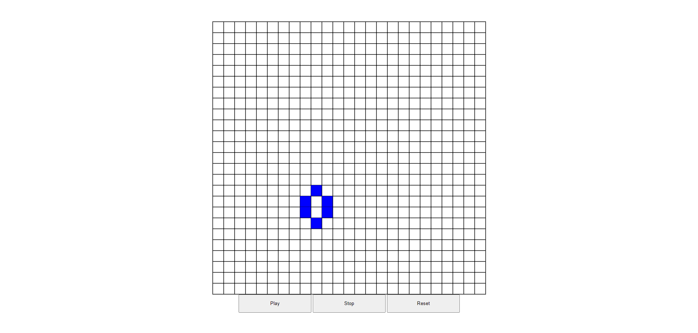

# Conway's Game of Life

This is a simple implementation of the Conway's Game of Life using HTML, javascript and some css

## Game Rules

The game is implemented in a 2 dimensional space. Each cell can be either dead or alive according to the following rules:
  
  1-Any live cell with fewer than two live neighbors dies, as if by underpopulation.
  
  2-Any live cell with two or three live neighbors lives on to the next generation.
  
  3-Any live cell with more than three live neighbors dies, as if by overpopulation.
  
  4-Any dead cell with exactly three live neighbors becomes a live cell, as if by reproduction.

## Usability

Currently the game only has the options to Play,Stop or Reset, but in the future will have the options to resize the grid, change the colors and upload files

